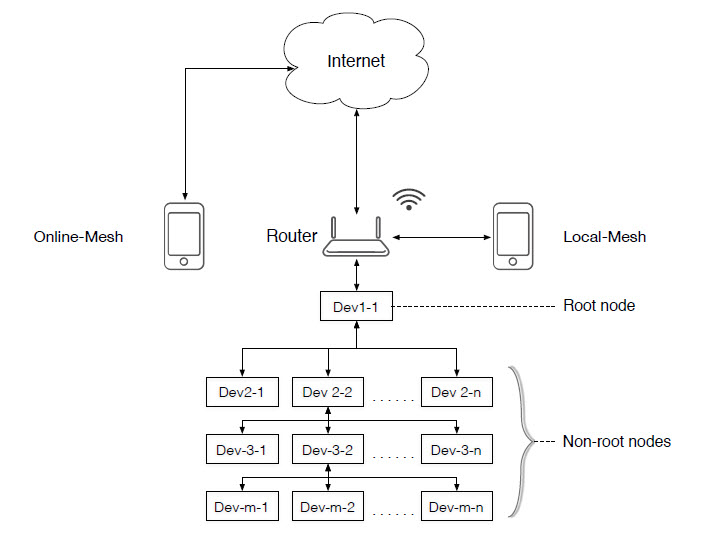
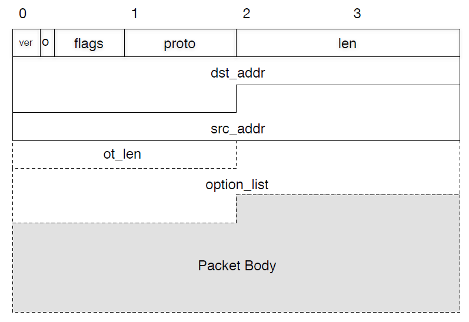

# Giới thiệu
Trong quá trình phát triển IoT thường đòi hỏi việc tăng số lượng node kết nối với Internet.Nhược điểm lớn nhất là số lượng node có thể trực tiếp kết nối tới router bị giới hạn nhỏ hơn 32 node. Để khắc phục điểm này thì Espressif đã phát triển giao thức ESP-MESH. Trong giao thức này node có thể tạo ra mạng để chuyển tiếp gói tin, nhờ đó mà một số lượng lớn node có thể kết nối Internet mà không cần phải cải tiến, nâng cấp router.

# Một số định nghĩa
- IOT Espressif App: ứng dụng của Espressif dùng để điều khiển từ xa các thiết bị Wifi
- ESP-Touch: công nghệ để kết nối Wifi device với router
- Smart Config Mode cho ESP-Touch: cấu hình cho Wifi device dùng ESP-Touch thông qua Mode Smart Config.
- Local Device: thiết bị được người dùng cấu hình kết nối với router thông qua ESP-Touch mà không kích hoạt trên server, chỉ có thể điều khiển thông qua mạng cục bộ
- Cloud Device: giống như Local Device nhưng được kích hoạt trên server, có thể điều khiển ở mọi nơi có mạng internet.

# Cấu trúc mạng
Mạng Mesh hỗ trợ chức năng auto-networking. Khi người dùng thiết lập mạng mesh thông qua ESP-Touch thì thiết bị sẽ tự động tìm các Wifi AP gần kề.

## Sơ đồ mạng mesh

- Các node sẽ kết nối trực tiếp tới router được gọi là root node, các node khác thì được gọi là non-root node.
- Online-Mesh: Khi router kết nối với internet thì ta có thể dùng IOT App để điều khiển từ xa ở bất kỳ đâu
- Local-Mesh: Bạn chỉ có thể điều khiển Local Device trong mạng thông qua router.

## Các node trong mạng
- Root Node
    + Nhận và gửi gói tin
    + Chuyển tiếp gói tin từ server, ứng dụng mobile và các node con của nó
- None-root Node
    + Non-leaf node: Nhận và gửi gói tin, chuyển tiếp gói tin từ node cha và các node con khác
    + Leaf node: Chỉ được nhận và gửi gói tin, không có chức năng chuyển tiếp.

# Các header trong Mesh

Mô tả

| Tên trường  | Độ dài                | Mô tả                                                    |
|-------------|-----------------------|----------------------------------------------------------|
| ver         | 2 bit                 | Thông tin Mesh                                           |
| o           | 1 bit                 | Tùy chọn flag                                            |
| flags       | 5 bit                 | FP|FR|resv|resv|resv                                     |
|             | FP                    | Cho phép Piggyback flow trong gói tin                    |
|             | FR                    | Yêu cầu,Piggyback flow trong gói tin                     |
|             | resv                  | Dự phòng                                                 |
|             | 8 bit                 | D|P2P|Protocol                                           |
|             | D                     | Chiều của gói tin: 0: xuống (downward) 1: lên (upward)   |
|             | P2P                   | Gói tin từ Node tới Node                                 |
|             | protocol              | Giao thức gửi dữ liệu được quy định bởi người dùng(6bit) |
| len         | 2 byte                | Chiều dài của gói tin (bao gồm cả mesh header)           |
| dst_addr    | 6 bytes               | Địa chỉ đích                                             |
| src_addr    | 6 bytes               | Địa chỉ nguồn                                            |
| ot_len      |                       | Độ dài của option (gồm cả chính nó)                      |
| option_list |                       | Danh sách các thành phần của các option                  |
| otype       | 1 byte                | Kiểu option                                              |
| olen        | 1 byte                | Chiều dài của option hiện tịa                            |
| ovalue      | Người dùng định nghĩa | Giá trị option hiện tại                                  |

# Tham khảo
- [ESP-MESH](https://espressif.com/en/products/software/esp-mesh/overview)